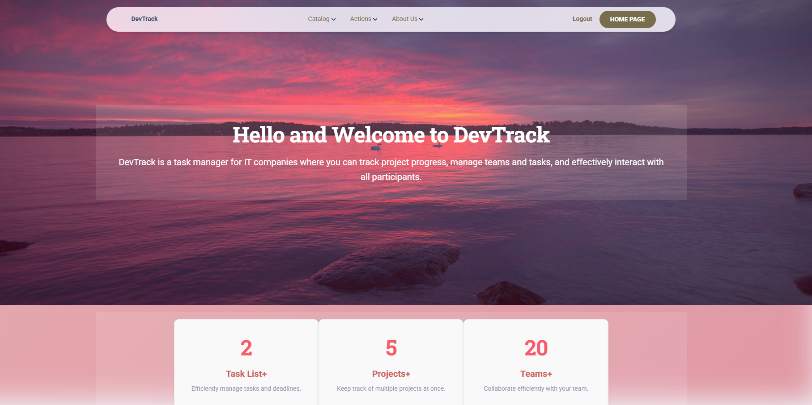

# DevTrack

DevTrack is a custom task management system for IT teams. It enables seamless coordination between developers, designers, project managers, and QA specialists. Users can create tasks, assign them to team members, and mark them as complete before the deadline, offering an internal solution to project management.

## Features
- Simple and user-friendly interface for a quick start.
- Flexible configuration of project priorities and statuses.
- Local database integration for storing team data.

## Check in!
https://devtrack-5isw.onrender.com/

## Why DevTrack?
I built this project to make daily task tracking easier for my team. It’s stripped down to the essentials — no fluff, just what we need to get things done. Plus, it’s a great way to practice Django and create something useful!

## Login
username: admin.user

password 1234qwert


## Installation
1. Clone the repository:
   ```bash
   git clone https://github.com/TrMaksym/DevTrack.git
   cd DevTrack

2. Creating and activating a virtual environment
   
   For Windows:
   ```bash
   python -m venv venv
   venv\Scripts\activate

   For macOS/Linux:
   python3 -m venv venv
   source venv/bin/activate
   
3. Install dependencies
   ```bash
   pip install -r requirements.txt
   
4. Apply database migrations
   ```bash
   python manage.py migrate

   
## Dependencies
- Django 5.1.7
- python-decouple 3.8
- django-crispy-forms 2.3
- crispy-bootstrap4 2024.10

## Admin credentials

- Username: admin.user
- Password: 1234qwert



